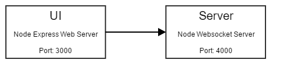

Websocket Server & SAP UI5 chat client
======
This simple setup shall demonstrate an opinionated docker setup for a small websocket chat application in SAP UI5

##For Development & Debugging
````bash
docker-compose up -d
````
##For hosting
````bash
docker-compose -f docker-compose.prod.yml up -d
````

Architecture
-----



* A Node.js (express) webapp as chat client
* A Node.js (ws) as chat backend server

Debugging
-----
The repository includes predefined debugging settings for [Visual Studio Code](https://code.visualstudio.com/) :
* Websocket server
* Client server
* Chrome Remote Debugging of the SAP UI5 app

Therefore a '.vscode' debug configuration folder is provided and can be used


Additional
-----

For testing purposes you can also use the chrome websocket client webapp
[Simple Websocket Client](https://chrome.google.com/webstore/detail/simple-websocket-client/pfdhoblngboilpfeibdedpjgfnlcodoo)
Use [ws://localhost:4000](ws://localhost:4000) for the connection to the backend server container.